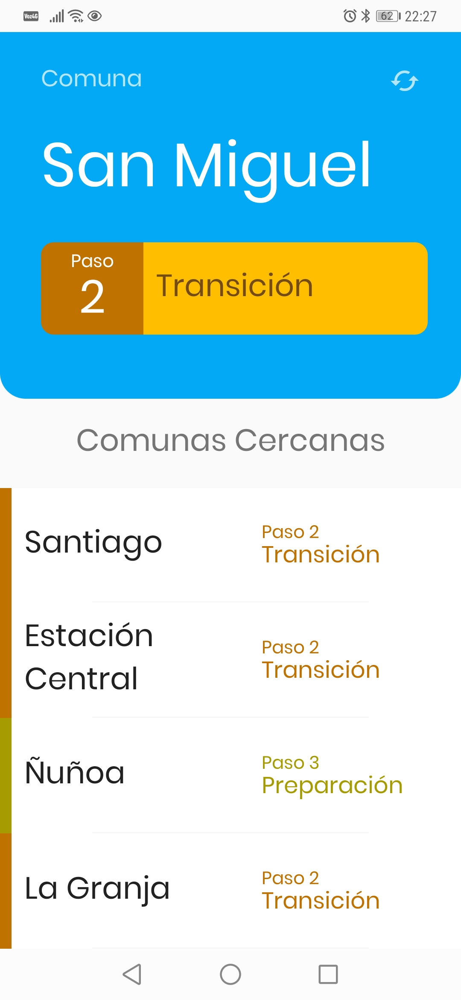

# Pandemia Chile


Pandemia Chile es una aplicación para conocer la situación comunal del plan [Paso a Paso ](https://www.gob.cl/coronavirus/pasoapaso/) según la comuna en donde te encuentres. Se utiliza la información subida al repositorio [MinCiencia](https://github.com/MinCiencia/Datos-COVID19) que es recolectada por el proyecto [pandemia-chile-data](https://github.com/Josel95/pandemia-chile-data).



## Instalación

Esta aplicación es desarrollada utilizando [expo](https://github.com/expo/expo).

Una vez clonado el repositorio debes instalar las dependencias como se indica a continuación:

```bash
yarn install
```

Una vez instaladas las dependencias debes instalar la cli de expo:

```bash
npm install --global expo-cli
```

Para iniciar el proyecto simplemente debes ejecutar:

```bash
npm start
```

Recomiendo no utilizar el gestor de paquetes `yarn` en este proyecto (en otros definitivamente si lo recomiendo) ya que he experimentado ciertos problemas al instalar librerias que no son compatibles con linux.

## Credenciales

Esta aplicación hace uso de firebase y la api geocoding de google, para utilizar estas apis se deben proveer ciertas credenciales. Estas credenciales al ser de caracter privado deben estar presentes en el archivo .gitignore. A continuación se indica donde debe estar presentes estas credenciales.

#### `src/firebase/config.json`
En este archivo se deben especificar las credenciales de firebase, estas pueden ser obtenidas desde la consola de administración de tu proyecto de firebase. Tienen el siguiente formato: 

```json
{
    "apiKey": "TU API KEY",
    "authDomain": "nombre-proyecto-firebase.firebaseapp.com",
    "projectId": "nombre-proyecto-firebase",
    "storageBucket": "nombre-proyecto-firebase.appspot.com",
    "messagingSenderId": "TU MESSAGING SENDER ID",
    "appId": "TU APP ID",
    "measurementId": "TU MEASUREMENT ID"
}
```

#### `src/geocoding/key.json`
En este archivo se debe especificar el token para utilizar la api de Google Geocoding. Este token lo puedes encontrar en tu panel de administración de GCP vinculado con tu proyecto de firebase. Tiene el siguiente formato:

```json
{
    "key": "TU API KEY"
}
```

## Contribuciones
Este proyecto es desarrollado en mis tiempos libres y solo por hobby. De todas maneras si deseas colaborar bienvenido sea.

## License
[MIT](https://choosealicense.com/licenses/mit/)